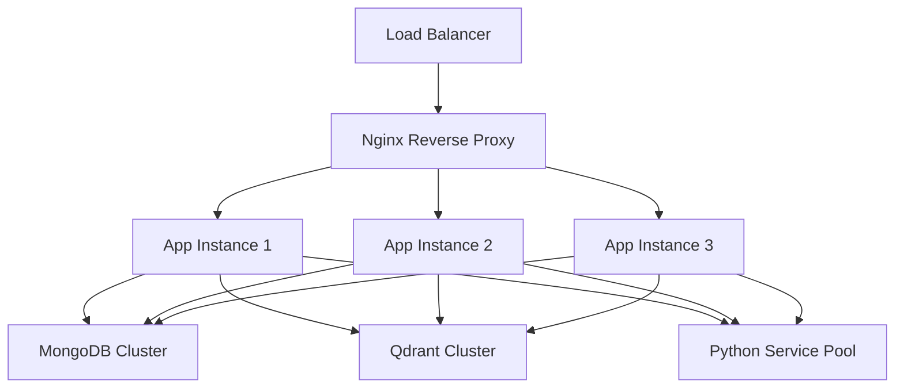

# 프로덕션 배포 가이드

---
type: guide
---

## 개요
AI Quiz Backend를 프로덕션 환경에 안전하고 확장 가능하게 배포하는 방법을 안내합니다.

## 🏗 프로덕션 아키텍처

### 권장 구성


### 인프라 요구사항
- **최소 권장**: 4 vCPU, 8GB RAM
- **권장 사양**: 8 vCPU, 16GB RAM, SSD 저장소
- **네트워크**: 1 Gbps 이상
- **OS**: Ubuntu 20.04+ 또는 CentOS 8+

## 🚀 배포 단계

### 1단계: 서버 준비

#### 시스템 업데이트
```bash
# Ubuntu/Debian
sudo apt update && sudo apt upgrade -y
sudo apt install -y curl wget git htop

# CentOS/RHEL
sudo yum update -y
sudo yum install -y curl wget git htop
```

#### Docker 설치
```bash
# Docker 공식 설치 스크립트
curl -fsSL https://get.docker.com -o get-docker.sh
sudo sh get-docker.sh

# Docker Compose 설치
sudo curl -L "https://github.com/docker/compose/releases/latest/download/docker-compose-$(uname -s)-$(uname -m)" -o /usr/local/bin/docker-compose
sudo chmod +x /usr/local/bin/docker-compose

# 사용자를 docker 그룹에 추가
sudo usermod -aG docker $USER
```

### 2단계: 배포 환경 설정

#### 프로젝트 구조
```bash
# 프로덕션 디렉토리 생성
sudo mkdir -p /opt/ai-quiz
sudo chown $USER:$USER /opt/ai-quiz
cd /opt/ai-quiz

# 디렉토리 구조
mkdir -p {config,logs,data,ssl,backups}
```

#### 환경 변수 설정
```bash
# /opt/ai-quiz/.env.production
NODE_ENV=production
PORT=5000

# 보안 관련
OPENAI_API_KEY=your_production_api_key
JWT_SECRET=your-super-secret-jwt-key

# 데이터베이스 
MONGODB_URI=mongodb://mongodb-primary:27017/ai_quiz_prod
MONGODB_USERNAME=ai_quiz_user
MONGODB_PASSWORD=secure_password

# 벡터 데이터베이스
QDRANT_URL=http://qdrant-cluster:6333
QDRANT_API_KEY=your_qdrant_api_key
QDRANT_COLLECTION=ai_quiz_prod

# 로깅
LOG_LEVEL=warn
LOG_FILE=/opt/ai-quiz/logs/app.log

# 성능 설정
CHUNK_MAX_TOKENS=500
LLM_MAX_TOKENS=4000
MAX_FILE_SIZE=104857600  # 100MB

# 보안 설정
RATE_LIMIT_WINDOW=60000
RATE_LIMIT_MAX_REQUESTS=100
CORS_ORIGINS=https://yourdomain.com,https://api.yourdomain.com
```

### 3단계: 프로덕션 Docker Compose

#### docker-compose.prod.yml
```yaml
version: '3.8'

services:
  # Nginx Reverse Proxy
  nginx:
    image: nginx:alpine
    ports:
      - "80:80"
      - "443:443"
    volumes:
      - ./config/nginx.conf:/etc/nginx/nginx.conf:ro
      - ./ssl:/etc/nginx/ssl:ro
      - ./logs/nginx:/var/log/nginx
    depends_on:
      - app
    restart: always
    networks:
      - frontend

  # Main Application (3 replicas)
  app:
    image: your-registry/ai-quiz-backend:latest
    env_file: .env.production
    volumes:
      - ./uploads:/app/uploads
      - ./logs:/app/logs
    depends_on:
      - mongodb
      - qdrant
    restart: always
    deploy:
      replicas: 3
      resources:
        limits:
          memory: 1G
          cpus: '0.5'
        reservations:
          memory: 512M
          cpus: '0.25'
    networks:
      - frontend
      - backend
    healthcheck:
      test: ["CMD", "curl", "-f", "http://localhost:5000/health"]
      interval: 30s
      timeout: 10s
      retries: 3

  # Python PDF Service
  python-pdf:
    image: your-registry/ai-quiz-python:latest
    env_file: .env.production
    restart: always
    deploy:
      replicas: 2
      resources:
        limits:
          memory: 512M
          cpus: '0.3'
    networks:
      - backend

  # MongoDB Replica Set
  mongodb-primary:
    image: mongo:7.0
    command: mongod --replSet rs0 --bind_ip_all
    environment:
      MONGO_INITDB_ROOT_USERNAME: ${MONGODB_USERNAME}
      MONGO_INITDB_ROOT_PASSWORD: ${MONGODB_PASSWORD}
      MONGO_INITDB_DATABASE: ai_quiz_prod
    volumes:
      - mongodb-primary-data:/data/db
      - ./backups:/backups
    restart: always
    networks:
      - backend

  mongodb-secondary:
    image: mongo:7.0
    command: mongod --replSet rs0 --bind_ip_all
    volumes:
      - mongodb-secondary-data:/data/db
    restart: always
    networks:
      - backend

  # Qdrant Cluster
  qdrant:
    image: qdrant/qdrant:latest
    volumes:
      - qdrant-data:/qdrant/storage
    environment:
      - QDRANT__SERVICE__HTTP_PORT=6333
      - QDRANT__CLUSTER__ENABLED=true
    restart: always
    networks:
      - backend

  # Monitoring
  prometheus:
    image: prom/prometheus:latest
    ports:
      - "9090:9090"
    volumes:
      - ./config/prometheus.yml:/etc/prometheus/prometheus.yml
      - prometheus-data:/prometheus
    restart: always
    networks:
      - monitoring

  grafana:
    image: grafana/grafana:latest
    ports:
      - "3000:3000"
    environment:
      - GF_SECURITY_ADMIN_PASSWORD=${GRAFANA_PASSWORD}
    volumes:
      - grafana-data:/var/lib/grafana
    restart: always
    networks:
      - monitoring

volumes:
  mongodb-primary-data:
  mongodb-secondary-data:
  qdrant-data:
  prometheus-data:
  grafana-data:

networks:
  frontend:
    driver: bridge
  backend:
    driver: bridge
    internal: true
  monitoring:
    driver: bridge
```

### 4단계: Nginx 설정

#### config/nginx.conf
```nginx
events {
    worker_connections 1024;
}

http {
    upstream app_servers {
        ip_hash;  # 세션 지속성
        server app:5000 max_fails=3 fail_timeout=30s;
    }

    # Rate limiting
    limit_req_zone $binary_remote_addr zone=api:10m rate=10r/s;
    limit_req_zone $binary_remote_addr zone=upload:1m rate=1r/s;

    # SSL 설정
    ssl_protocols TLSv1.2 TLSv1.3;
    ssl_ciphers ECDHE-RSA-AES256-GCM-SHA384:ECDHE-RSA-CHACHA20-POLY1305;
    ssl_prefer_server_ciphers off;

    # 보안 헤더
    add_header X-Frame-Options DENY;
    add_header X-Content-Type-Options nosniff;
    add_header X-XSS-Protection "1; mode=block";
    add_header Strict-Transport-Security "max-age=31536000; includeSubDomains" always;

    server {
        listen 80;
        server_name yourdomain.com;
        return 301 https://$server_name$request_uri;
    }

    server {
        listen 443 ssl http2;
        server_name yourdomain.com;

        ssl_certificate /etc/nginx/ssl/cert.pem;
        ssl_certificate_key /etc/nginx/ssl/key.pem;

        # File upload 제한
        client_max_body_size 100M;

        # API 엔드포인트
        location /api/ {
            limit_req zone=api burst=20 nodelay;
            proxy_pass http://app_servers;
            proxy_set_header Host $host;
            proxy_set_header X-Real-IP $remote_addr;
            proxy_set_header X-Forwarded-For $proxy_add_x_forwarded_for;
            proxy_set_header X-Forwarded-Proto $scheme;
            
            # 타임아웃 설정
            proxy_connect_timeout 10s;
            proxy_send_timeout 60s;
            proxy_read_timeout 60s;
        }

        # 파일 업로드 엔드포인트
        location /api/documents/upload {
            limit_req zone=upload burst=5 nodelay;
            proxy_pass http://app_servers;
            proxy_set_header Host $host;
            proxy_set_header X-Real-IP $remote_addr;
            
            # 업로드를 위한 긴 타임아웃
            proxy_connect_timeout 10s;
            proxy_send_timeout 300s;
            proxy_read_timeout 300s;
        }

        # Health check
        location /health {
            proxy_pass http://app_servers;
            access_log off;
        }

        # 정적 파일 (필요시)
        location /static/ {
            root /var/www;
            expires 1y;
            add_header Cache-Control "public, immutable";
        }
    }
}
```

### 5단계: 모니터링 설정

#### Prometheus 설정
```yaml
# config/prometheus.yml
global:
  scrape_interval: 15s

scrape_configs:
  - job_name: 'ai-quiz-app'
    static_configs:
      - targets: ['app:5000']
    metrics_path: '/metrics'
    scrape_interval: 30s

  - job_name: 'node-exporter'
    static_configs:
      - targets: ['node-exporter:9100']

  - job_name: 'mongodb'
    static_configs:
      - targets: ['mongodb-exporter:9216']

  - job_name: 'qdrant'
    static_configs:
      - targets: ['qdrant:6333']
    metrics_path: '/metrics'
```

### 6단계: 백업 전략

#### MongoDB 백업 스크립트
```bash
#!/bin/bash
# backup.sh

BACKUP_DIR="/opt/ai-quiz/backups"
TIMESTAMP=$(date +%Y%m%d_%H%M%S)
BACKUP_NAME="mongodb_backup_$TIMESTAMP"

# MongoDB 백업
docker exec mongodb-primary mongodump \
  --archive=/backups/$BACKUP_NAME.archive \
  --gzip \
  --db ai_quiz_prod

# 오래된 백업 정리 (30일 이상)
find $BACKUP_DIR -name "mongodb_backup_*.archive" -mtime +30 -delete

# S3 업로드 (선택적)
aws s3 cp $BACKUP_DIR/$BACKUP_NAME.archive s3://your-backup-bucket/
```

#### Qdrant 백업
```bash
#!/bin/bash
# backup-qdrant.sh

BACKUP_DIR="/opt/ai-quiz/backups/qdrant"
TIMESTAMP=$(date +%Y%m%d_%H%M%S)

# Qdrant 스냅샷 생성
curl -X POST "http://localhost:6333/collections/ai_quiz_prod/snapshots"

# 백업 파일 복사
docker cp qdrant:/qdrant/storage/snapshots $BACKUP_DIR/$TIMESTAMP
```

### 7단계: 배포 자동화

#### 배포 스크립트
```bash
#!/bin/bash
# deploy-prod.sh

set -e

echo "🚀 Starting production deployment..."

# 설정 파일 검증
if [[ ! -f .env.production ]]; then
    echo "❌ .env.production file not found"
    exit 1
fi

# 백업 수행
echo "📂 Creating backup..."
./backup.sh

# 새 이미지 빌드 및 푸시
echo "🔨 Building and pushing images..."
docker build -t your-registry/ai-quiz-backend:latest .
docker build -t your-registry/ai-quiz-python:latest -f Dockerfile.python .

docker push your-registry/ai-quiz-backend:latest
docker push your-registry/ai-quiz-python:latest

# 롤링 업데이트
echo "🔄 Performing rolling update..."
docker-compose -f docker-compose.prod.yml pull
docker-compose -f docker-compose.prod.yml up -d --no-deps app

# 헬스 체크
echo "🔍 Health check..."
sleep 30
for i in {1..5}; do
    if curl -f http://localhost/health; then
        echo "✅ Deployment successful!"
        exit 0
    fi
    echo "⏳ Waiting for health check... ($i/5)"
    sleep 10
done

echo "❌ Health check failed. Rolling back..."
docker-compose -f docker-compose.prod.yml rollback app
exit 1
```

## 🔐 보안 강화

### SSL/TLS 설정
```bash
# Let's Encrypt 인증서 획득
certbot certonly --webroot -w /var/www/certbot \
  -d yourdomain.com \
  -m admin@yourdomain.com \
  --agree-tos

# 자동 갱신 설정
echo "0 12 * * * /usr/bin/certbot renew --quiet" | crontab -
```

### 방화벽 설정
```bash
# UFW 설정
sudo ufw default deny incoming
sudo ufw default allow outgoing
sudo ufw allow ssh
sudo ufw allow 80/tcp
sudo ufw allow 443/tcp
sudo ufw enable

# SSH 강화
sudo sed -i 's/#PasswordAuthentication yes/PasswordAuthentication no/' /etc/ssh/sshd_config
sudo systemctl restart ssh
```

### 컨테이너 보안
```yaml
# Docker Compose 보안 설정
services:
  app:
    security_opt:
      - no-new-privileges:true
    read_only: true
    tmpfs:
      - /tmp
    user: "1001:1001"  # 비루트 사용자
```

## 📊 성능 최적화

### 리소스 모니터링
```bash
# 시스템 리소스 모니터링
docker stats
htop
iotop
```

### 데이터베이스 최적화
```javascript
// MongoDB 인덱스 생성
db.documents.createIndex({ "uploadedAt": -1 })
db.chunks.createIndex({ "documentId": 1, "pageNumber": 1 })
```

### 캐싱 전략
```yaml
# Redis 캐시 추가
redis:
  image: redis:7-alpine
  command: redis-server --appendonly yes
  volumes:
    - redis-data:/data
  restart: always
```

## 🚨 장애 대응

### 모니터링 알림
```yaml
# AlertManager 설정
global:
  smtp_smarthost: 'localhost:587'
  smtp_from: 'alerts@yourdomain.com'

route:
  group_by: ['alertname']
  group_wait: 10s
  group_interval: 10s
  repeat_interval: 1h
  receiver: 'web.hook'

receivers:
- name: 'web.hook'
  email_configs:
  - to: 'admin@yourdomain.com'
    subject: 'AI Quiz Alert: {{ .GroupLabels.alertname }}'
```

### 로그 관리
```bash
# 로그 로테이션 설정
cat > /etc/logrotate.d/ai-quiz << EOF
/opt/ai-quiz/logs/*.log {
    daily
    missingok
    rotate 30
    compress
    delaycompress
    notifempty
    copytruncate
}
EOF
```

## 📝 배포 체크리스트

### 배포 전 확인사항
- [ ] 환경 변수 설정 완료
- [ ] SSL 인증서 설치 및 설정
- [ ] 데이터베이스 백업 완료
- [ ] 모니터링 시스템 구성
- [ ] 로드 테스트 수행
- [ ] 장애 복구 절차 문서화

### 배포 후 확인사항
- [ ] 헬스 체크 통과
- [ ] API 엔드포인트 동작 확인
- [ ] 파일 업로드 기능 테스트
- [ ] 퀴즈 생성 기능 검증
- [ ] 모니터링 대시보드 확인
- [ ] 로그 수집 정상 동작

## 관련 문서
- [[deployment/docker.md]]: Docker 배포 기본 가이드
- [[development/setup.md]]: 개발 환경 설정
- [[troubleshooting.md]]: 문제해결 가이드

프로덕션 환경에서 안정적으로 서비스를 운영하기 위해 이 가이드를 단계별로 따라주시기 바랍니다! 🚀
