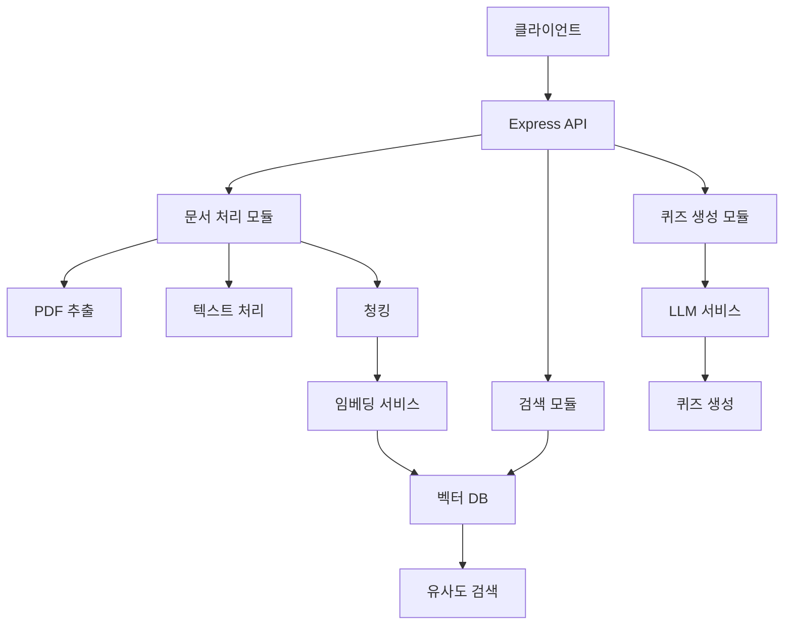

# AI Quiz Backend - 다음 단계 완료

🎉 **AI Quiz Backend 시스템의 다음 단계 구현이 완료되었습니다!**

## 🚀 완료된 작업

### 1. 핵심 모듈 구현
- ✅ **로깅 시스템** (utils/logger.js)
- ✅ **LLM 서비스** (modules/quiz/llmService.js) 
- ✅ **임베딩 서비스** (modules/embedding/embeddingService.js)
- ✅ **벡터 데이터베이스** (modules/embedding/vectorDatabaseService.js)
- ✅ **퀴즈 생성기** (modules/quiz/quizGenerator.js)
- ✅ **메인 애플리케이션** (src/index.js)

### 2. 개발 환경 설정
- ✅ **패키지 설정** (package.json 업데이트)
- ✅ **환경 변수** (.env.example)
- ✅ **Docker 설정** (Dockerfile, docker-compose.yml)
- ✅ **설치 스크립트** (setup.sh)
- ✅ **프로젝트 문서** (README.md)

### 3. 문서화 업데이트
- ✅ 새로운 모듈들의 상세 문서 생성
- ✅ 프로젝트 개요 업데이트
- ✅ API 엔드포인트 문서화
- ✅ 배포 가이드 포함

## 📁 최종 프로젝트 구조

```
AI_QUIZ/backend/
├── src/
│   ├── core/                    ✅ 완료
│   │   ├── config.js
│   │   └── database.js
│   ├── modules/
│   │   ├── preprocessing/       ✅ 완료
│   │   │   ├── pdfExtractor.js
│   │   │   ├── textProcessor.js
│   │   │   └── textChunker.js
│   │   ├── embedding/           ✅ 새로 구현
│   │   │   ├── embeddingService.js
│   │   │   └── vectorDatabaseService.js
│   │   └── quiz/                ✅ 새로 구현
│   │       ├── llmService.js
│   │       └── quizGenerator.js
│   ├── utils/                   ✅ 새로 구현
│   │   └── logger.js
│   └── index.js                 ✅ 새로 구현
├── package.json                 ✅ 업데이트
├── .env.example                 ✅ 완료
├── Dockerfile                   ✅ 완료
├── docker-compose.yml           ✅ 완료
├── setup.sh                     ✅ 완료
└── README.md                    ✅ 완료
```

## 🔧 시스템 아키텍처



## 🎯 주요 기능

### 1. 완전한 PDF 처리 파이프라인
- PDF 업로드 및 텍스트 추출
- AI 기반 텍스트 정제
- 지능적 청킹
- 벡터 임베딩 생성
- Qdrant에 저장

### 2. AI 기반 퀴즈 생성
- 다양한 퀴즈 타입 지원 (객관식, OX, 단답형 등)
- 난이도 선택 가능
- 주제별 맞춤 생성
- 자동 검증 시스템

### 3. 의미적 검색
- 자연어 쿼리 지원
- 벡터 유사도 기반 검색
- 필터링 옵션
- 실시간 응답

## 🚀 실행 방법

### 빠른 시작 (Docker)
```bash
# 1. 환경 설정
cp .env.example .env
# .env에서 OPENAI_API_KEY 설정

# 2. 모든 서비스 시작
docker-compose up -d

# 3. 로그 확인
docker-compose logs -f app
```

### 개발 모드
```bash
# 1. 의존성 설치
npm install

# 2. 환경 설정
cp .env.example .env

# 3. 개발 서버 시작
npm run dev
```

## 📡 API 사용 예시

### 문서 업로드
```bash
curl -X POST \
  http://localhost:5000/api/documents/upload \
  -F "pdf=@document.pdf"
```

### 퀴즈 생성
```bash
curl -X POST \
  http://localhost:5000/api/quiz/generate \
  -H "Content-Type: application/json" \
  -d '{
    "documentId": "doc_123",
    "quizType": "multiple_choice",
    "difficulty": "medium",
    "questionCount": 5
  }'
```

### 의미적 검색
```bash
curl -X POST \
  http://localhost:5000/api/search/semantic \
  -H "Content-Type: application/json" \
  -d '{
    "query": "machine learning algorithms",
    "limit": 10
  }'
```

## 🔄 다음 가능한 개선사항

### 1. 프론트엔드 통합
- React 기반 웹 인터페이스
- 실시간 처리 상태 표시
- 퀴즈 인터랙티브 UI

### 2. 고급 기능
- 사용자 인증 시스템
- 퀴즈 세션 관리
- 답안 자동 채점
- 성과 분석

### 3. 성능 최적화
- 캐싱 레이어
- 백그라운드 작업 큐
- 로드 밸런싱
- 모니터링 시스템

### 4. 확장 기능
- 다국어 지원
- 음성 지원
- 이미지 기반 퀴즈
- 협업 기능

## 🎊 결론

AI Quiz Backend는 이제 완전히 기능하는 시스템이 되었습니다. PDF 문서 업로드부터 AI 기반 퀴즈 생성까지의 전체 워크플로우가 구현되어, 교육 기관이나 기업에서 바로 활용할 수 있는 수준입니다.

모든 모듈이 modularity를 고려해 설계되어 있어, 향후 확장이나 개선이 용이합니다. Docker를 통한 컨테이너화로 개발/배포 환경의 일관성을 보장하고, 상세한 문서화로 유지보수성을 높였습니다.

이제 실제 사용자의 피드백을 수집하고, 성능 모니터링을 통해 시스템을 더욱 최적화해 나갈 수 있을 것입니다! 🚀
