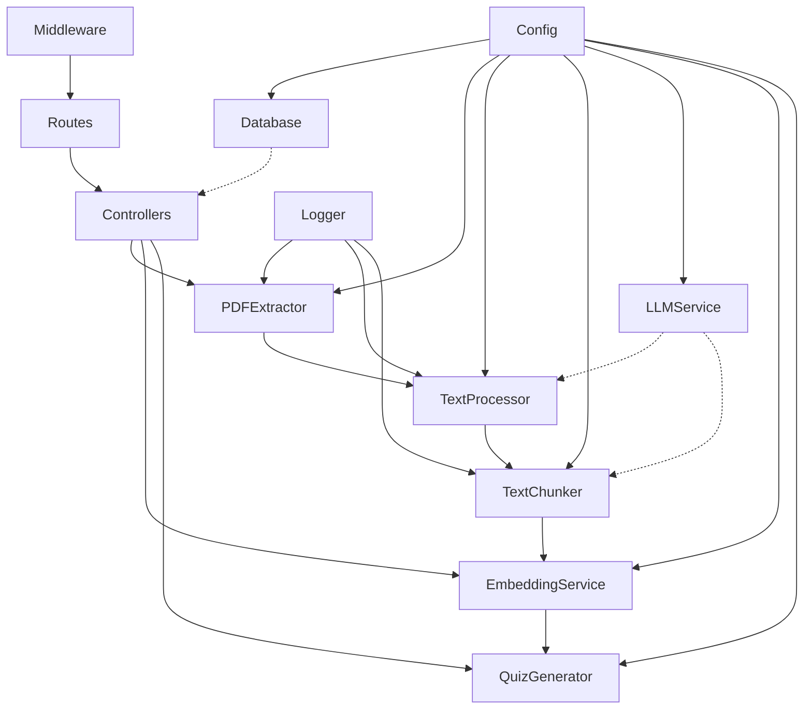

# 코드 관계 맵

---
type: map
---

## 핵심 모듈 관계도

## 주요 데이터 흐름

### 문서 처리 흐름
[[PDF File]] → [[src/modules/preprocessing/pdfExtractor.js]] → [[src/modules/preprocessing/textProcessor.js]] → [[src/modules/preprocessing/textChunker.js]] → [[Text Chunks]]

### 퀴즈 생성 흐름 (예상)
[[Text Chunks]] → [[src/modules/embedding/embeddingService.js]] → [[src/modules/quiz/quizGenerator.js]] → [[Quiz Items]]

### 설정 의존성 체인
[[Environment Variables]] → [[src/core/config.js]] → [[All Modules]]

## 모듈 간 결합도
- **High Coupling**: Core 모듈들 (Config, Database)
- **Medium Coupling**: Preprocessing 체인
- **Low Coupling**: API Layer와 Business Logic
- **Loose Coupling**: Utility 모듈들

## 확장 포인트
1. **새 전처리 모듈** 추가: TextChunker 이후 단계
2. **다중 LLM 지원**: LLMService 인터페이스 확장
3. **새 임베딩 모델**: EmbeddingService 추상화
4. **추가 퀴즈 타입**: QuizGenerator 플러그인 구조

## 성능 병목점
- PDF 추출 단계 (특히 OCR)
- LLM API 호출
- 대용량 텍스트 청킹
- 임베딩 생성 과정
