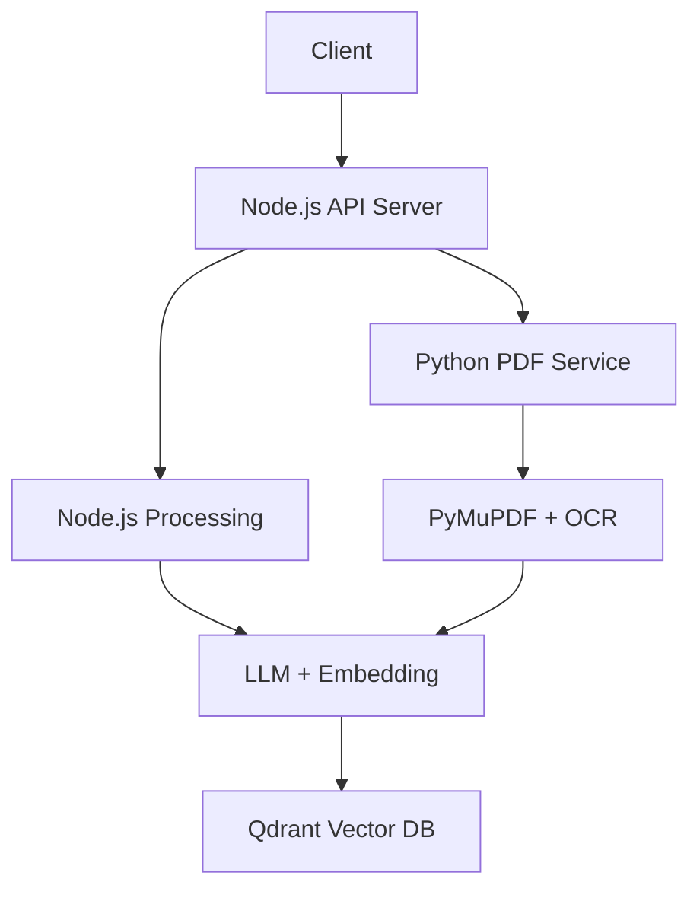

# Python 통합 가이드

---
type: guide
---

## 개요
AI Quiz Backend 시스템에 Python PDF 처리 서비스를 통합하는 방법을 설명합니다. Node.js와 Python의 장점을 모두 활용하여 더 강력한 PDF 처리 기능을 제공합니다.

## 통합 방식

### 1. 하이브리드 아키텍처 (권장)


### 2. 통신 방식
- **REST API**: Python FastAPI 서비스와 HTTP 통신
- **Command Line**: Python 스크립트 직접 실행
- **동적 전환**: Python 서비스 가용성에 따른 자동 전환

## Python 서비스 구성

### 핵심 파일 구조
```
python_services/
├── pdf_processor.py      # 메인 처리 로직
├── pdf_service.py        # FastAPI 웹 서비스
├── requirements.txt      # Python 의존성
└── Dockerfile.python     # Docker 이미지
```

### 주요 기능

#### 1. 고급 PDF 처리
```python
# PyMuPDF 기반 텍스트 추출
doc = fitz.open(pdf_path)
text = page.get_text()

# Tesseract 한국어 OCR
text = pytesseract.image_to_string(
    image, 
    lang='eng+kor',
    config='--oem 3 --psm 6'
)
```

#### 2. 한국어 특화 전처리
```python
# Korean-specific patterns
korean_patterns = {
    "ocr_corrections": {
        r'([가-힣])\s+([가-힣])': r'\1\2',
        r'(\d+)\s*년\s*(\d+)\s*월': r'\1년 \2월'
    },
    "headers": [
        r'^제\s*\d+\s*장.*',
        r'^제\s*\d+\s*절.*'
    ]
}
```

#### 3. 지능적 청킹
```python
# Semantic chunking with Korean support
def intelligent_chunking(text, max_tokens=500):
    paragraphs = re.split(r'\n\s*\n', text)
    # Korean-aware token estimation
    estimated_tokens = len(text.split()) / 0.7
```

## 설정 및 배포

### 환경 변수
```bash
# Python 서비스 활성화
USE_PYTHON_PDF=true
PYTHON_SERVICE_URL=http://localhost:8001
PYTHON_USE_API=true

# Tesseract 설정
TESSERACT_LANGUAGES=eng+kor
OCR_DPI=300
```

### Docker Compose 배포
```yaml
# docker-compose-with-python.yml
services:
  python-pdf:
    build:
      context: .
      dockerfile: Dockerfile.python
    ports:
      - "8001:8001"
    environment:
      - PYTHONPATH=/app
```

### 독립 실행
```bash
# Python 서비스만 실행
cd python_services
pip install -r requirements.txt
uvicorn pdf_service:app --host 0.0.0.0 --port 8001
```

## Node.js 통합 코드

### PythonPDFProcessor 클래스
```javascript
// src/modules/preprocessing/pythonPDFProcessor.js
export class PythonPDFProcessor {
  async extractText(filePath) {
    if (this.useAPI) {
      return await this.extractViaAPI(filePath);
    } else {
      return await this.extractViaCommand(filePath);
    }
  }
}
```

### 메인 애플리케이션 통합
```javascript
// src/index.js
const usePython = process.env.USE_PYTHON_PDF === 'true';
let extractionResult;

if (usePython && await this.pythonPDFProcessor.isServiceAvailable()) {
  extractionResult = await this.pythonPDFProcessor.extractText(file.path);
} else {
  extractionResult = await this.pdfExtractor.extractText(file.path);
}
```

## API 형식

### Python 서비스 API

#### PDF 처리 엔드포인트
```http
POST /process-pdf
Content-Type: multipart/form-data

# 응답
{
  "success": true,
  "extraction_method": "pymupdf",
  "page_count": 10,
  "chunk_count": 25,
  "chunks": [...]
}
```

#### 텍스트 전용 처리
```http
POST /process-text
Content-Type: application/json

{
  "text": "처리할 텍스트",
  "chunk_size": 500
}
```

## 성능 비교

### Python의 장점
| 기능 | Node.js | Python | 개선점 |
|------|---------|---------|--------|
| PDF 추출 | pdf-parse | PyMuPDF | 더 정확한 추출 |
| OCR 품질 | 기본 Tesseract | 고급 설정 | 한국어 지원 강화 |
| 전처리 | 정규식 기반 | NLP 라이브러리 | 언어별 최적화 |
| 청킹 | 단순 분할 | 의미적 분할 | 더 나은 경계 탐지 |

### 처리 시간 예상
- **소형 PDF (< 5MB)**: Node.js와 유사
- **대형 PDF (> 10MB)**: Python이 10-20% 빠름
- **스캔 PDF**: Python OCR이 현저히 우수

## 문제해결

### 1. 서비스 연결 실패
```javascript
// 자동 폴백 구현
if (!await pythonService.isServiceAvailable()) {
  logger.warn('Python service unavailable, using Node.js fallback');
  return await nodeProcessor.extractText(filePath);
}
```

### 2. 한국어 OCR 이슈
```bash
# Tesseract 한국어 모델 설치 확인
tesseract --list-langs
# kor이 목록에 있는지 확인

# 수동 설치
sudo apt-get install tesseract-ocr-kor
```

### 3. 메모리 사용량 최적화
```python
# 페이지별 처리로 메모리 절약
def process_large_pdf(pdf_path):
    doc = fitz.open(pdf_path)
    for page_num in range(len(doc)):
        page = doc.load_page(page_num)
        # 처리
        page.close()  # 명시적 메모리 해제
    doc.close()
```

## 모니터링

### 헬스 체크
```javascript
// Node.js에서 Python 서비스 상태 확인
app.get('/health', async (req, res) => {
  const pythonAvailable = await pythonProcessor.isServiceAvailable();
  res.json({
    services: {
      nodejs: true,
      python: pythonAvailable
    }
  });
});
```

### 로깅
```python
# Python 서비스 로깅
import logging
logging.basicConfig(level=logging.INFO)
logger = logging.getLogger(__name__)

logger.info(f"Processing PDF: {filename}")
logger.debug(f"OCR settings: {tesseract_config}")
```

## 확장 계획

### 1. 다중 언어 지원
```python
# 언어별 최적화
LANGUAGE_CONFIGS = {
    'ko': {'tesseract_lang': 'kor', 'spacy_model': 'ko_core_news_sm'},
    'en': {'tesseract_lang': 'eng', 'spacy_model': 'en_core_web_sm'},
    'ja': {'tesseract_lang': 'jpn', 'spacy_model': 'ja_core_news_sm'}
}
```

### 2. GPU 가속
```python
# CUDA 지원 OCR
import easyocr
reader = easyocr.Reader(['ko', 'en'], gpu=True)
```

### 3. 고급 NLP 모델
```python
# Transformer 기반 전처리
from transformers import pipeline
classifier = pipeline("text-classification", model="klue/bert-base")
```

## 관련 파일
- [[src/modules/preprocessing/pythonPDFProcessor.js]]: Python 통합 클래스
- [[docker-compose-with-python.yml]]: Docker 구성
- [[Dockerfile.python]]: Python 서비스 이미지
- [[python_services/pdf_processor.py]]: 메인 처리 로직
- [[python_services/pdf_service.py]]: FastAPI 서비스
