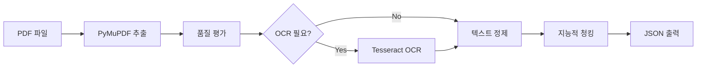

# python_services/pdf_processor.py

---
type: file
path: python_services/pdf_processor.py
language: python
---

## 목적
Python을 활용한 고급 PDF 처리 스크립트입니다. PyMuPDF와 Tesseract OCR을 사용하여 정확한 텍스트 추출과 한국어 특화 전처리를 수행합니다.

## 주요 클래스/함수
| 이름 | 유형 | 목적 |
|------|------|------|
| `AdvancedPDFProcessor` | 클래스 | PDF 텍스트 추출 및 OCR 처리 |
| `AdvancedTextPreprocessor` | 클래스 | 한국어 특화 텍스트 전처리 |
| `extract_text_with_pymupdf()` | 메서드 | PyMuPDF를 사용한 직접 텍스트 추출 |
| `extract_with_ocr()` | 메서드 | Tesseract OCR 기반 텍스트 추출 |
| `assess_text_quality()` | 메서드 | 추출된 텍스트 품질 평가 |
| `intelligent_chunking()` | 메서드 | 한국어 지원 지능적 텍스트 청킹 |

## 의존성
- `PyMuPDF (fitz)`: PDF 조작 및 텍스트 추출
- `pytesseract`: Tesseract OCR Python 래퍼
- `PIL (Pillow)`: 이미지 처리
- `re`: 정규 표현식 처리
- `json`: JSON 데이터 처리

## 데이터 흐름


## 핵심 기능

### 1. 이중 추출 전략
```python
# 1차: PyMuPDF 직접 추출
result = self.extract_text_with_pymupdf(pdf_path)

# 2차: 품질 평가 후 OCR
if self.assess_text_quality(result["text"])["needs_ocr"]:
    ocr_result = self.extract_with_ocr(pdf_path)
```

### 2. 텍스트 품질 평가
- 텍스트 길이 확인 (최소 50자)
- 특수문자 비율 계산 (50% 이상 시 OCR 시도)
- 한국어/영어 단어 밀도 확인

### 3. 한국어 특화 처리
```python
korean_patterns = {
    "ocr_corrections": {
        r'([가-힣])\s+([가-힣])': r'\1\2',  # 한글 단어 내 공백 제거
        r'(\d+)\s*년\s*(\d+)\s*월': r'\1년 \2월',  # 날짜 정규화
    },
    "headers": [
        r'^제\s*\d+\s*장.*',  # 장 헤더
        r'^제\s*\d+\s*절.*',  # 절 헤더
    ]
}
```

### 4. 지능적 청킹
- 문단 경계 기반 분할
- 섹션 헤더 인식
- 한국어 토큰 추정 (1토큰 ≈ 0.7단어)
- 청크별 메타데이터 생성

## 사용 방법

### 명령줄 실행
```bash
# 기본 실행
python pdf_processor.py document.pdf

# 출력 파일 지정
python pdf_processor.py document.pdf --output result.json

# 청크 크기 조정
python pdf_processor.py document.pdf --chunk-size 1000

# OCR 언어 설정
python pdf_processor.py document.pdf --lang eng+kor+jpn
```

### 프로그래밍 인터페이스
```python
# PDF 처리기 초기화
pdf_processor = AdvancedPDFProcessor()
text_processor = AdvancedTextPreprocessor()

# PDF 처리
pdf_result = pdf_processor.process_pdf('document.pdf')
text_result = text_processor.process_text(pdf_result['text'])

print(f"페이지 수: {pdf_result['page_count']}")
print(f"청크 수: {text_result['total_chunks']}")
```

## 출력 형식

### PDF 추출 결과
```json
{
  "text": "추출된 전체 텍스트",
  "page_count": 10,
  "page_texts": ["페이지별 텍스트"],
  "images_found": 5,
  "method": "pymupdf",
  "success": true
}
```

### 텍스트 처리 결과
```json
{
  "cleaned_text": "정제된 텍스트",
  "chunks": [
    {
      "content": "청크 내용",
      "index": 0,
      "token_count": 245,
      "chunk_id": "chunk_0_1715692800000"
    }
  ],
  "total_chunks": 25,
  "success": true
}
```

### 최종 통합 결과
```json
{
  "pdf_extraction": { /* PDF 추출 결과 */ },
  "text_processing": { /* 텍스트 처리 결과 */ },
  "metadata": {
    "source_file": "document.pdf",
    "processing_time": "2.5s"
  }
}
```

## 고급 기능

### OCR 최적화
- 2배 확대로 OCR 정확도 향상
- 한국어+영어 동시 인식
- OEM 3, PSM 6 모드 사용

### 에러 처리
- PDF 읽기 실패 시 graceful fallback
- OCR 실패 시 기본 추출 결과 사용
- 상세한 에러 메시지와 로깅

### 성능 최적화
- 페이지별 처리로 메모리 효율성
- 불필요한 이미지 변환 최소화
- 적응적 OCR 적용

## 설정 옵션

### Tesseract 설정
```python
self.tesseract_config = r'--oem 3 --psm 6'
self.languages = 'eng+kor'  # 언어 설정
```

### 청킹 파라미터
- `max_tokens`: 청크당 최대 토큰 수 (기본 500)
- Korean token estimation: 1 token ≈ 0.7 words

## 확장 가능성

### 1. 다중 언어 지원
```python
# 일본어, 중국어 등 추가
self.languages = 'eng+kor+jpn+chi_sim'
```

### 2. 고급 OCR 엔진
```python
# EasyOCR 통합
import easyocr
reader = easyocr.Reader(['ko', 'en'])
```

### 3. 문서 구조 분석
```python
# 제목, 표, 그림 자동 인식
def analyze_document_structure(self, pdf_path):
    # 구조적 요소 분석
    pass
```

## 관련 파일
- [[python_services/pdf_service.py]]: FastAPI 웹 서비스
- [[python_services/requirements.txt]]: Python 의존성
- [[src/modules/preprocessing/pythonPDFProcessor.js]]: Node.js 통합
- [[python-integration.md]]: Python 통합 가이드

## 문제해결

### 일반적인 문제
1. **Tesseract 설치 오류**: `sudo apt-get install tesseract-ocr tesseract-ocr-kor`
2. **PyMuPDF 설치 문제**: `pip install PyMuPDF`
3. **한국어 인식 불가**: 언어 패키지 설치 확인
4. **메모리 부족**: 대용량 PDF는 페이지별 처리

### 디버깅 팁
- 로그 레벨을 DEBUG로 설정
- 중간 결과를 파일로 저장하여 확인
- OCR 전후 이미지 비교
