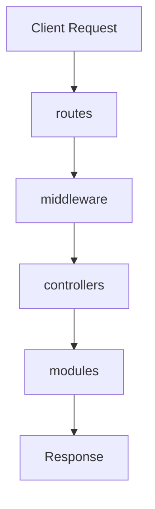

# api

---
type: directory
path: src/api/
---

## 목적
클라이언트의 HTTP 요청을 처리하는 REST API 계층을 구성합니다. 컨트롤러, 미들웨어, 라우트로 구성되어 있습니다.

## 주요 파일
없음 (모든 기능이 하위 디렉토리에 구성됨)

## 하위 디렉토리
| 디렉토리 | 목적 |
|---------|------|
| [[src/api/controllers/index]] | API 엔드포인트 로직 처리 (현재 미구현) |
| [[src/api/middleware/index]] | 요청 전처리 및 인증 미들웨어 (현재 미구현) |
| [[src/api/routes/index]] | API 라우트 정의 (현재 미구현) |

## 관계

## 예상 API 구조

### 문서 처리 API
- `POST /api/documents/upload`: PDF 파일 업로드
- `GET /api/documents/:id`: 문서 정보 조회
- `GET /api/documents/:id/chunks`: 문서 청크 조회

### 퀴즈 API
- `POST /api/quiz/generate`: 텍스트 기반 퀴즈 생성
- `GET /api/quiz/:id`: 퀴즈 조회
- `POST /api/quiz/:id/submit`: 퀴즈 답안 제출

### 검색 API
- `POST /api/search/semantic`: 의미적 검색
- `GET /api/search/similar/:chunkId`: 유사 청크 검색

## 설계 패턴
- **MVC 패턴**: Model(modules) - View(API Response) - Controller
- **레이어드 아키텍처**: Route → Middleware → Controller → Service
- **REST 원칙**: 자원 기반 URL 구조
