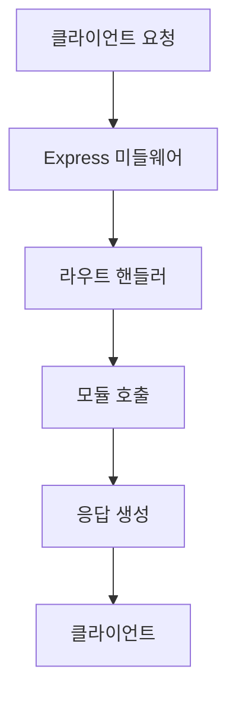

# index.js

---
type: file
path: src/index.js
language: javascript
---

## 목적
AI Quiz 백엔드 애플리케이션의 메인 진입점입니다. Express.js 서버를 초기화하고 모든 모듈을 통합하여 완전한 PDF 기반 퀴즈 생성 시스템을 제공합니다.

## 주요 함수/클래스
| 이름 | 유형 | 목적 |
|------|------|------|
| `AIQuizApp` | 클래스 | 메인 애플리케이션 클래스 |
| `initializeMiddleware()` | 메서드 | Express 미들웨어 설정 |
| `initializeRoutes()` | 메서드 | API 엔드포인트 정의 |
| `handleDocumentUpload()` | 메서드 | PDF 업로드 및 처리 |
| `handleGenerateQuiz()` | 메서드 | 퀴즈 생성 처리 |
| `handleSemanticSearch()` | 메서드 | 의미적 검색 처리 |
| `start()` | 메서드 | 애플리케이션 시작 |

## 의존성
- `express`: 웹 프레임워크
- `cors`: CORS 설정
- `multer`: 파일 업로드 처리
- 모든 핵심 모듈들 (preprocessing, embedding, quiz 등)

## 데이터 흐름


## 주요 기능

### 1. 서버 초기화
- Express 애플리케이션 설정
- 모든 비즈니스 로직 모듈 인스턴스 생성
- 미들웨어 및 라우트 설정

### 2. 미들웨어 구성
- CORS 설정 (개발/프로덕션 환경별)
- 파일 업로드 (Multer: PDF, 50MB 제한)
- JSON/URL-encoded 파싱
- 요청 로깅

### 3. API 엔드포인트
#### 문서 처리
- `POST /api/documents/upload` - PDF 업로드 및 전체 파이프라인 실행
- `GET /api/documents/:id` - 문서 정보 조회
- `DELETE /api/documents/:id` - 문서 삭제

#### 퀴즈 생성
- `POST /api/quiz/generate` - 문서 기반 퀴즈 생성
- `POST /api/quiz/generate-from-query` - 검색어 기반 퀴즈 생성

#### 검색
- `POST /api/search/semantic` - 의미적 검색
- `GET /api/search/similar/:chunkId` - 유사 청크 검색

#### 시스템
- `GET /health` - 서버 상태 확인
- `GET /api/stats` - 시스템 통계

## 코드 예시
```javascript
// 애플리케이션 시작
const app = new AIQuizApp();
app.start();

// 문서 업로드 요청
POST /api/documents/upload
Content-Type: multipart/form-data
{
  pdf: <file>
}

// 퀴즈 생성 요청
POST /api/quiz/generate
{
  "documentId": "doc_123",
  "quizType": "multiple_choice",
  "difficulty": "medium",
  "questionCount": 5
}
```

## 전체 파이프라인 처리

### 문서 업로드 파이프라인


1. **PDF 업로드**: Multer로 파일 수신
2. **텍스트 추출**: pdfExtractor + OCR
3. **텍스트 정제**: textProcessor + LLM
4. **청킹**: textChunker
5. **임베딩**: embeddingService
6. **저장**: vectorDatabaseService

### 퀴즈 생성 파이프라인


## 환경 설정
```javascript
// 필수 환경 변수
- OPENAI_API_KEY: OpenAI API 키
- PORT: 서버 포트 (기본 5000)
- CORS_ORIGINS: 허용된 Origin 목록

// 선택적 환경 변수
- MONGODB_URI: MongoDB 연결 문자열
- QDRANT_URL: Qdrant 서버 URL
- UPLOAD_DIR: 파일 업로드 디렉토리
```

## 에러 처리
- 글로벌 에러 핸들러
- 404 처리
- 각 단계별 에러 로깅
- 개발/프로덕션 환경별 에러 응답

## 보안 기능
- CORS 설정
- 파일 타입 검증 (PDF만 허용)
- 파일 크기 제한 (50MB)
- 업로드 파일 자동 정리

## 성능 최적화
- 스트리밍 파일 업로드
- 메모리 효율적인 처리
- 배치 처리 지원
- 적절한 타임아웃 설정

## 모니터링
- 모든 요청 로깅
- 서버 상태 체크 엔드포인트
- 시스템 통계 제공
- 상세한 에러 로깅

## 잠재적 개선사항
- 인증/인가 시스템 추가
- Rate Limiting 구현
- 요청 검증 미들웨어
- API 문서 자동 생성 (Swagger)
- 캐싱 레이어 추가
- 백그라운드 작업 큐
