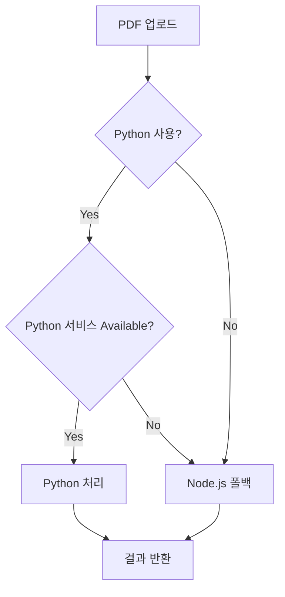

# index_with_python.js

---
type: file
path: src/index_with_python.js
language: javascript
---

## 목적
Python PDF 처리 서비스가 통합된 버전의 메인 애플리케이션 엔트리 포인트입니다. 기본 [[src/index.js]]에 Python 통합 기능을 추가한 확장 버전입니다.

## 주요 함수/클래스
| 이름 | 유형 | 목적 |
|------|------|------|
| `AIQuizApp` | 클래스 | Python 통합 애플리케이션 클래스 |
| `handleDocumentUpload()` | 메서드 | Python/Node.js 선택적 문서 처리 |
| `initializeRoutes()` | 메서드 | Python 서비스 상태 포함 라우트 설정 |

## [[src/index.js]]와의 차이점

### 1. 추가된 임포트
```javascript
// Python PDF 처리기 추가
import { PythonPDFProcessor } from './modules/preprocessing/pythonPDFProcessor.js';
```

### 2. 서비스 초기화
```javascript
constructor() {
  // 기존 서비스들
  this.pdfExtractor = new PDFExtractor();
  
  // Python 처리기 추가
  this.pythonPDFProcessor = new PythonPDFProcessor();
  
  // 나머지 서비스들...
}
```

### 3. 향상된 헬스 체크
```javascript
app.get('/health', async (req, res) => {
  const pythonAvailable = await this.pythonPDFProcessor.isServiceAvailable();
  
  res.json({
    status: 'ok',
    timestamp: new Date().toISOString(),
    services: {
      database: Database.getConnectionStatus(),
      vectorDB: 'checking...',
      pythonPDFService: pythonAvailable  // Python 서비스 상태 추가
    }
  });
});
```

### 4. 지능적 PDF 처리 선택
```javascript
async handleDocumentUpload(req, res) {
  try {
    // ... 기본 검증 로직

    // Python 사용 여부 결정
    const usePython = process.env.USE_PYTHON_PDF === 'true';
    let extractionResult;

    if (usePython && await this.pythonPDFProcessor.isServiceAvailable()) {
      this.logger.info('Using Python PDF processor');
      extractionResult = await this.pythonPDFProcessor.extractText(file.path);
      
      // Python 처리기가 청크까지 반환하는 경우
      if (extractionResult.chunks) {
        const embeddedChunks = await this.embeddingService.generateEmbeddings(extractionResult.chunks);
        await this.vectorService.storeChunks(embeddedChunks, documentId);
        
        return res.json({
          success: true,
          documentId,
          metadata: {
            filename: file.originalname,
            pageCount: extractionResult.pageCount,
            chunkCount: embeddedChunks.length,
            extractionMethod: extractionResult.method,
            processor: 'python'  // 처리기 정보 추가
          }
        });
      }
    } else {
      this.logger.info('Using Node.js PDF processor');
      extractionResult = await this.pdfExtractor.extractText(file.path);
    }
    
    // Node.js 텍스트 처리 파이프라인 계속
    // ... 나머지 로직
  }
}
```

### 5. 확장된 통계 정보
```javascript
async handleGetStats(req, res) {
  try {
    const vectorStats = await this.vectorService.getCollectionStats();
    const pythonAvailable = await this.pythonPDFProcessor.isServiceAvailable();
    
    res.json({
      success: true,
      stats: {
        vectorDatabase: vectorStats,
        services: {
          llm: this.quizGenerator.llmService.isAvailable(),
          embedding: true,
          vectorDB: await this.vectorService.isAvailable(),
          pythonPDF: pythonAvailable  // Python 서비스 상태 추가
        }
      }
    });
  }
}
```

## 설정 방법

### 환경 변수
```bash
# Python 사용 활성화
USE_PYTHON_PDF=true

# Python 서비스 URL
PYTHON_SERVICE_URL=http://localhost:8001

# API 모드 사용 (명령줄 대신)
PYTHON_USE_API=true
```

### 실행 방법
```bash
# Python 버전으로 실행
node src/index_with_python.js

# 환경 변수와 함께 실행
USE_PYTHON_PDF=true node src/index_with_python.js
```

## 처리 흐름

### 1. Python 우선 처리


### 2. 완전한 Python 처리 경로


### 3. 하이브리드 처리 경로


## 장점

### 1. 최적의 PDF 처리
- Python: 복잡한 PDF, 스캔 문서, 한국어 문서
- Node.js: 간단한 PDF, 빠른 처리

### 2. 점진적 통합
- 기존 Node.js 코드 100% 유지
- Python 서비스 장애 시 자동 폴백
- 설정으로 쉬운 전환

### 3. 향상된 모니터링
- Python 서비스 상태 실시간 확인
- 처리기별 성능 메트릭
- 상세한 처리 정보

## 운영 고려사항

### 1. 서비스 의존성
- Python 서비스가 중단되면 Node.js로 자동 전환
- 헬스 체크로 서비스 상태 모니터링
- 로그로 어떤 처리기 사용했는지 추적

### 2. 성능 최적화
- Python 서비스 연결 풀링
- 캐싱 전략 (문서 타입별)
- 로드 밸런싱 (여러 Python 인스턴스)

### 3. 장애 대응
```javascript
// Python 서비스 불가 시 로깅
if (!await this.pythonPDFProcessor.isServiceAvailable()) {
  this.logger.warn('Python PDF service unavailable, using Node.js fallback');
}
```

## Docker 환경에서의 실행

### docker-compose-with-python.yml
```yaml
services:
  app:
    environment:
      - USE_PYTHON_PDF=true
      - PYTHON_SERVICE_URL=http://python-pdf:8001
    depends_on:
      - python-pdf
```

## 주의사항

### 1. 메모리 사용량
- Python 서비스가 별도 프로세스로 실행
- 대용량 PDF 처리 시 메모리 모니터링 필요

### 2. 네트워크 지연
- HTTP 통신으로 인한 약간의 오버헤드
- 로컬 네트워크 사용으로 최소화

### 3. 호환성 확인
- Python 서비스 버전과 Node.js 클라이언트 호환성
- API 인터페이스 변경 시 양쪽 모두 업데이트

## 관련 파일
- [[src/index.js]]: 기본 버전 애플리케이션
- [[src/modules/preprocessing/pythonPDFProcessor.js]]: Python 통합 클래스
- [[python_services/pdf_service.py]]: Python FastAPI 서비스
- [[python-integration.md]]: Python 통합 상세 가이드
- [[deployment/docker.md]]: Docker 배포 방법

## 마이그레이션 가이드

### index.js에서 index_with_python.js로 전환
1. 환경 변수 설정
2. Python 서비스 시작
3. 메인 파일 교체
4. 모니터링 및 검증

이 버전은 Python의 강력한 PDF 처리 기능과 Node.js의 빠른 웹 서버 기능을 결합하여 최적의 성능을 제공합니다! 🐍⚡
