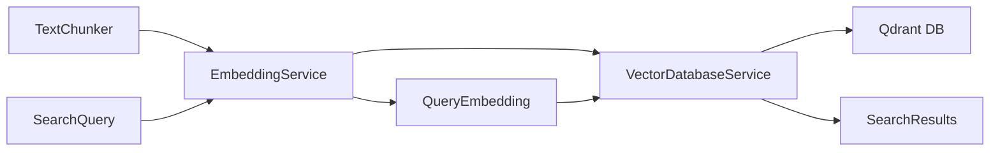
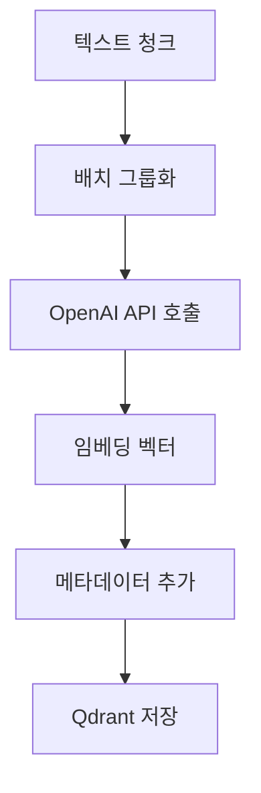
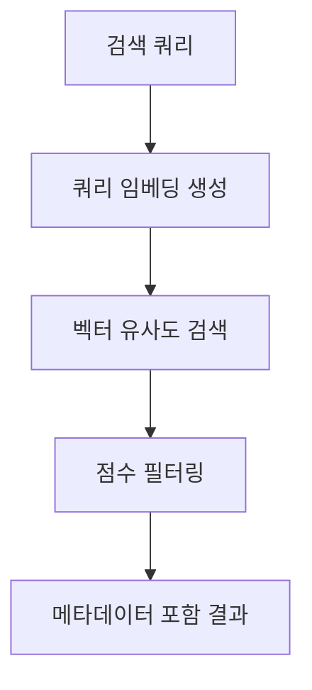

# embedding

---
type: directory
path: src/modules/embedding/
---

## 목적
텍스트를 벡터 임베딩으로 변환하고, 벡터 데이터베이스와 상호작용하여 의미적 검색을 지원하는 모듈입니다.

## 주요 파일
| 파일 | 역할 |
|------|------|
| [[src/modules/embedding/embeddingService.js]] | 텍스트 임베딩 생성 및 유사도 계산 |
| [[src/modules/embedding/vectorDatabaseService.js]] | Qdrant 벡터 DB 통합 |

## 하위 디렉토리
없음

## 관계


## 핵심 기능

### 1. 임베딩 생성
- **모델**: OpenAI text-embedding-ada-002 (1536차원)
- **E5 모델 지원**: 향후 로컬 E5 모델 통합 준비
- **배치 처리**: 100개 청크 단위로 효율적 처리

### 2. 벡터 데이터베이스 관리  
- **Qdrant 통합**: 코사인 유사도 기반 검색
- **자동 컬렉션 관리**: 컬렉션 생성 및 설정
- **메타데이터 저장**: 풍부한 청크 정보 보존

### 3. 의미적 검색
- **쿼리 처리**: 자연어 → 임베딩 → 유사 벡터 검색
- **필터링**: 문서 ID, 페이지 번호 등으로 결과 제한
- **점수 임계값**: 관련성 기준으로 결과 필터링

## 데이터 흐름

### 임베딩 생성 흐름


### 검색 흐름  


## 성능 특성

### 처리 용량
- **임베딩 생성**: ~500 청크/분
- **검색 속도**: ~10-50ms per query
- **저장 효율**: 1536 float per chunk

### 최적화 기법
- **배치 처리**: API 호출 최소화
- **HNSW 인덱싱**: 빠른 근사 검색
- **메타데이터 인덱싱**: 필터링 성능 향상

## 설정 옵션

### 임베딩 모델 설정
```javascript
// config.js
EMBEDDING_MODEL: {
  name: 'intfloat/e5-small-v2',     // 향후 사용
  dimensions: 384,                   // E5 모델 차원
  maxTokens: 512,
  prefix: {
    query: 'query: ',
    passage: 'passage: '
  }
}
```

### Qdrant 설정
```javascript
// config.js  
QDRANT_CONFIG: {
  url: 'http://localhost:6333',
  collection: 'ai_quiz_docs',
  distance: 'Cosine'
}
```

## 사용 예시

### 임베딩 생성
```javascript
const embeddingService = new EmbeddingService();
const embeddedChunks = await embeddingService.generateEmbeddings(chunks);
```

### 벡터 검색
```javascript
const vectorService = new VectorDatabaseService();
await vectorService.storeChunks(embeddedChunks, 'doc_123');

const queryEmbedding = await embeddingService.generateQueryEmbedding("AI 알고리즘");
const results = await vectorService.searchSimilar(queryEmbedding, { limit: 5 });
```

## 확장 계획

### 1. 로컬 E5 모델 통합
```javascript
// 향후 구현
async generateE5Embeddings(texts) {
  // Hugging Face Transformers.js 활용
  // 또는 Python 서비스 연동
}
```

### 2. 하이브리드 검색
- 벡터 검색 + 키워드 검색 결합
- BM25 + 벡터 유사도 가중 조합

### 3. 다국어 지원
- 언어별 최적화된 임베딩 모델
- 언어 감지 및 자동 모델 선택

## 관련 모듈
- [[src/modules/preprocessing/textChunker.js]]: 청크 생성
- [[src/modules/quiz/quizGenerator.js]]: 임베딩 기반 청크 선택
- [[src/core/config.js]]: 임베딩 모델 설정

## 모니터링 포인트
- **API 호출량**: OpenAI 임베딩 비용 추적
- **검색 성능**: 평균 응답 시간 모니터링
- **저장소 사용량**: Qdrant 컬렉션 크기 추적
- **유사도 분포**: 검색 결과 품질 평가
