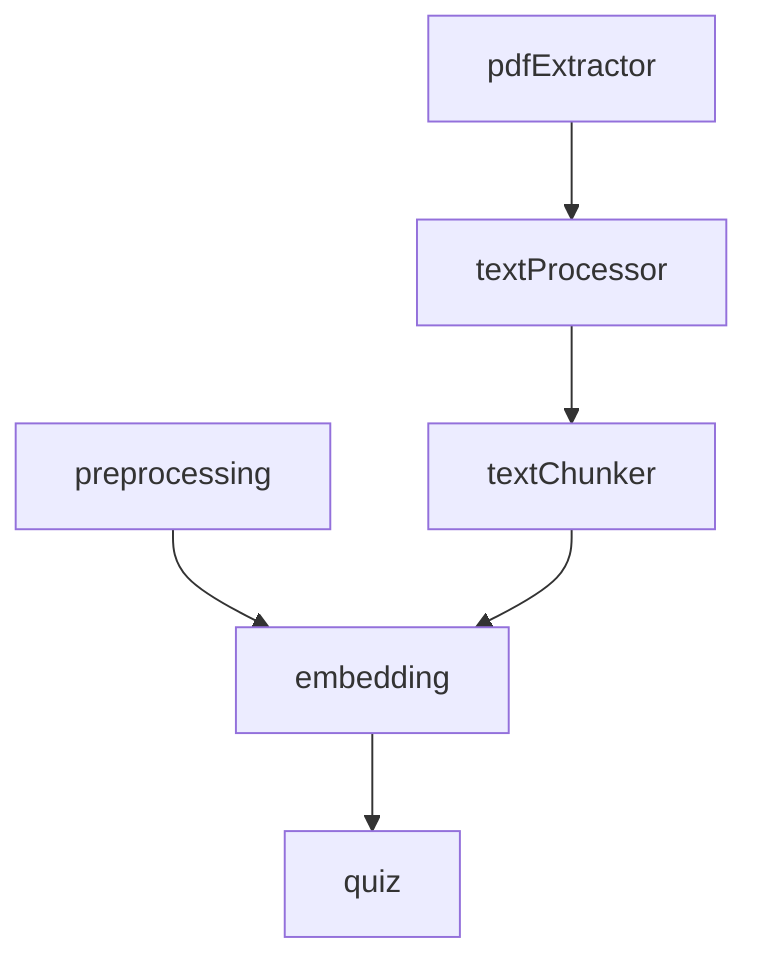

# modules

---
type: directory
path: src/modules/
---

## 목적
AI Quiz 애플리케이션의 핵심 비즈니스 로직을 담당하는 모듈들을 포함합니다. 각 모듈은 특정 기능에 특화되어 독립적으로 동작합니다.

## 주요 파일
없음 (모든 기능이 하위 디렉토리에 구성됨)

## 하위 디렉토리
| 디렉토리 | 목적 |
|---------|------|
| [[src/modules/preprocessing/index]] | PDF 문서 처리 및 텍스트 전처리 |
| [[src/modules/embedding/index]] | 텍스트 임베딩 생성 (현재 미구현) |
| [[src/modules/quiz/index]] | 퀴즈 생성 및 관리 (현재 미구현) |

## 관계

## 모듈간 데이터 흐름
1. **preprocessing**: PDF → 텍스트 → 정제된 텍스트 → 청크
2. **embedding**: 텍스트 청크 → 임베딩 벡터 → 벡터 저장소
3. **quiz**: 임베딩된 청크 → LLM 처리 → 퀴즈 문항

## 공통 설계 패턴
- **단일 책임 원칙**: 각 모듈은 하나의 명확한 목적을 가짐
- **의존성 주입**: core 설정과 서비스를 주입받아 사용
- **에러 처리**: 각 모듈에서 독립적인 에러 처리
- **로깅**: 모듈별 로거 사용으로 추적 가능성 제공
