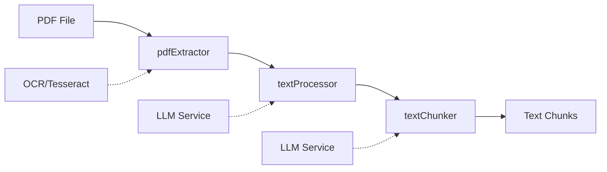

# preprocessing

---
type: directory
path: src/modules/preprocessing/
---

## 목적
PDF 문서에서 텍스트를 추출하고, 추출된 텍스트를 정제 및 처리하여 후속 모듈에서 사용할 수 있는 형태로 변환합니다.

## 주요 파일
| 파일 | 역할 |
|------|------|
| [[src/modules/preprocessing/pdfExtractor.js]] | PDF 파일에서 텍스트 추출 (OCR 포함) |
| [[src/modules/preprocessing/textProcessor.js]] | 추출된 텍스트 정제 및 LLM 기반 교정 |
| [[src/modules/preprocessing/textChunker.js]] | 텍스트를 의미 있는 청크로 분할 |

## 하위 디렉토리
없음

## 관계

## 처리 파이프라인
1. **PDF 추출** (pdfExtractor)
   - pdf-parse를 사용한 기본 텍스트 추출
   - 품질이 낮은 경우 OCR(Tesseract) 대체 사용
   - 메타데이터와 페이지 정보 포함

2. **텍스트 정제** (textProcessor)
   - 기본적인 텍스트 정규화 및 정제
   - LLM을 활용한 OCR 오류 수정
   - 포맷팅 및 문법 교정

3. **텍스트 청킹** (textChunker)
   - 의미적 경계를 고려한 텍스트 분할
   - 토큰 제한을 고려한 최적화
   - LLM 기반 청크 유효성 검증

## 설정 의존성
- [[src/core/config.js]]: `CHUNK_CONFIG` 설정값 사용
- LLM 서비스: 텍스트 교정 및 청크 검증용

## 에러 처리 전략
- 각 단계에서 실패 시 이전 단계 결과 활용
- OCR 실패 시 기본 추출 결과 사용
- LLM 서비스 불가 시 기본 처리만 수행
