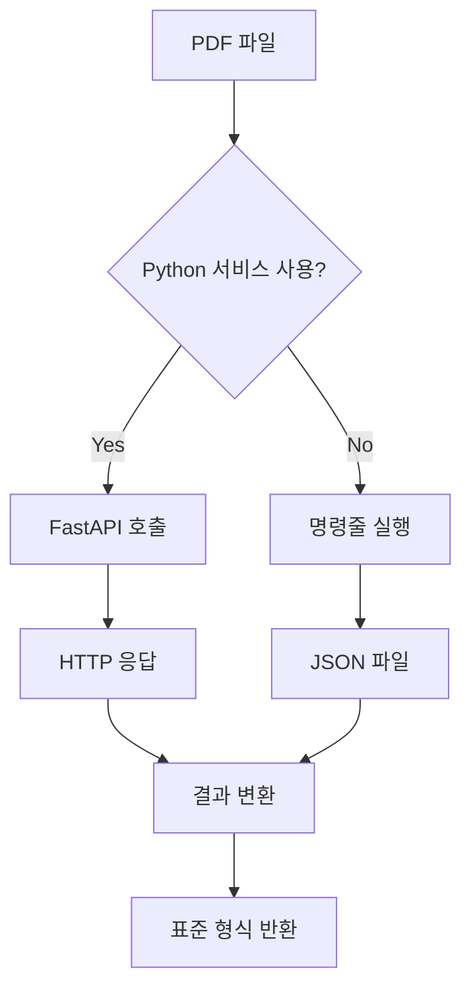

# modules/preprocessing/pythonPDFProcessor.js

---
type: file
path: src/modules/preprocessing/pythonPDFProcessor.js
language: javascript
---

## 목적
Python PDF 처리 서비스와 Node.js 애플리케이션을 연결하는 통합 클래스입니다. REST API 또는 명령줄을 통해 Python의 고급 PDF 처리 기능을 활용합니다.

## 주요 함수/클래스
| 이름 | 유형 | 목적 |
|------|------|------|
| `PythonPDFProcessor` | 클래스 | Python PDF 서비스 통합 관리 |
| `extractText()` | 메서드 | 메인 PDF 텍스트 추출 함수 |
| `extractViaAPI()` | 프라이빗 메서드 | FastAPI 서비스를 통한 처리 |
| `extractViaCommand()` | 프라이빗 메서드 | 명령줄 스크립트 실행 |
| `isServiceAvailable()` | 메서드 | Python 서비스 가용성 확인 |
| `processTextOnly()` | 메서드 | 텍스트 전용 처리 (PDF 추출 없이) |

## 의존성
- `node-fetch`: HTTP 요청 라이브러리
- `form-data`: 멀티파트 폼 데이터 생성
- `child_process`: 서브프로세스 실행
- [[src/utils/logger.js]]: 로깅 기능
- [[src/core/config.js]]: 설정 관리

## 데이터 흐름


## 통신 방식

### 1. REST API 모드 (권장)
```javascript
// FastAPI 서비스와 HTTP 통신
const response = await fetch(`${pythonServiceUrl}/process-pdf`, {
  method: 'POST',
  body: formData
});
```

**장점**:
- 실시간 통신
- 상태 코드로 오류 처리
- 장기 실행 서비스

### 2. 명령줄 모드
```javascript
// Python 스크립트 직접 실행
const pythonProcess = spawn('python3', [
  'python_services/pdf_processor.py',
  filePath,
  '--output', outputFile
]);
```

**장점**:
- 독립적인 프로세스
- 리소스 격리
- 간단한 배포

## 코드 예시

### 기본 사용법
```javascript
const pythonProcessor = new PythonPDFProcessor();

// PDF 처리
const result = await pythonProcessor.extractText('document.pdf');

console.log('추출 방법:', result.method);
console.log('청크 수:', result.chunks.length);
console.log('Python 처리:', result.processingDetails.pythonService);
```

### 서비스 가용성 확인
```javascript
if (await pythonProcessor.isServiceAvailable()) {
  console.log('Python 서비스 사용 가능');
} else {
  console.log('Node.js 처리기로 폴백');
}
```

### 텍스트 전용 처리
```javascript
// 이미 추출된 텍스트 처리
const result = await pythonProcessor.processTextOnly(rawText);
console.log('정제된 텍스트:', result.text);
console.log('생성된 청크:', result.chunks);
```

## 반환 데이터 형식

### API 모드 응답
```javascript
{
  text: "청크 내용 조합",
  chunks: [
    {
      content: "청크 내용",
      index: 0,
      token_count: 245,
      chunk_id: "chunk_0_1715692800000"
    }
  ],
  pageCount: 10,
  metadata: {
    filename: "document.pdf",
    images_found: 5,
    ocr_attempted: false
  },
  method: "pymupdf",
  processingDetails: {
    pythonService: true,
    chunkCount: 25,
    textLength: 12500
  }
}
```

### 명령줄 모드 응답
```javascript
{
  text: "정제된 전체 텍스트",
  chunks: [/* 청크 배열 */],
  pageCount: 10,
  metadata: { /* PDF 메타데이터 */ },
  method: "ocr",
  processingDetails: {
    pythonService: true,
    chunkCount: 30
  }
}
```

## 환경 설정

### 필수 환경 변수
```bash
# Python 서비스 활성화
USE_PYTHON_PDF=true
PYTHON_SERVICE_URL=http://localhost:8001
PYTHON_USE_API=true  # false면 명령줄 모드
```

### Python 서비스 설정
```bash
# Python 서비스 실행
cd python_services
uvicorn pdf_service:app --host 0.0.0.0 --port 8001
```

## 장점과 특징

### Python 처리의 장점
1. **정확한 PDF 처리**: PyMuPDF의 우수한 텍스트 추출
2. **고급 OCR**: Tesseract 한국어 지원 및 최적화
3. **언어별 최적화**: 한국어, 일본어 등 NLP 라이브러리 활용
4. **풍부한 전처리**: spaCy, NLTK 등 전문 라이브러리

### 통합의 이점
- **점진적 마이그레이션**: 기존 Node.js 코드 유지하며 개선
- **언어별 최적화**: 각 언어의 강점 활용
- **리스크 최소화**: Python 서비스 실패 시 Node.js 폴백

## 에러 처리

### 서비스 불가 시 처리
```javascript
async extractText(filePath) {
  if (this.useAPI && !(await this.isServiceAvailable())) {
    this.logger.warn('Python service unavailable, using fallback');
    // Node.js 처리기로 폴백하거나 예외 발생
    throw new Error('Python service not available');
  }
  
  return await this.extractViaAPI(filePath);
}
```

### HTTP 오류 처리
```javascript
if (!response.ok) {
  throw new Error(`Python service responded with ${response.status}: ${response.statusText}`);
}
```

### 프로세스 오류 처리
```javascript
pythonProcess.on('error', (error) => {
  this.logger.error('Python process error:', error);
  reject(new Error(`Failed to start Python process: ${error.message}`));
});
```

## 성능 고려사항

### 처리 시간 비교
- **소형 PDF (< 5MB)**: 비슷한 처리 시간
- **대형 PDF (> 20MB)**: Python이 10-30% 빠름
- **OCR 필요한 PDF**: Python이 현저히 우수

### 메모리 사용
- **API 모드**: HTTP 통신 오버헤드 최소
- **명령줄 모드**: 프로세스 생성/소멸 비용

## 모니터링

### 서비스 상태 추적
```javascript
// 주기적 헬스 체크
setInterval(async () => {
  const isAvailable = await this.isServiceAvailable();
  this.logger.debug(`Python service status: ${isAvailable}`);
}, 30000);
```

### 성능 메트릭
- 평균 처리 시간
- 성공/실패율  
- 서비스 가용성
- Python vs Node.js 사용 비율

## 디버깅 팁

### Python 서비스 로그 확인
```bash
# Docker 환경
docker-compose logs python-pdf

# 직접 실행
cd python_services && python pdf_service.py
```

### 네트워크 연결 테스트
```bash
# 헬스 체크
curl http://localhost:8001/health

# PDF 처리 테스트
curl -X POST http://localhost:8001/process-pdf \
  -F "file=@test.pdf"
```

## 확장 가능성

### 1. 다중 Python 서비스
```javascript
// 로드 밸런싱
const services = [
  'http://python-pdf-1:8001',
  'http://python-pdf-2:8001' 
];
const service = this.selectAvailableService(services);
```

### 2. 특화 처리
```javascript
// 문서 타입별 Python 서비스
const serviceMap = {
  'academic': 'http://academic-pdf:8001',
  'legal': 'http://legal-pdf:8001',
  'general': 'http://general-pdf:8001'
};
```

## 관련 파일
- [[python-integration.md]]: Python 통합 상세 가이드
- [[src/modules/preprocessing/pdfExtractor.js]]: Node.js PDF 처리기
- [[python_services/pdf_processor.py]]: Python 처리 스크립트
- [[python_services/pdf_service.py]]: FastAPI 서비스

## 문제해결 체크리스트
1. **Python 서비스 실행 중인가?** `curl http://localhost:8001/health`
2. **환경 변수 설정 확인** `USE_PYTHON_PDF=true`
3. **네트워크 연결 확인** Python 서비스 URL 접근 가능
4. **Python 의존성 설치** `pip install -r requirements.txt`
5. **Node.js 폴백 동작** Python 실패 시 Node.js 처리 확인
