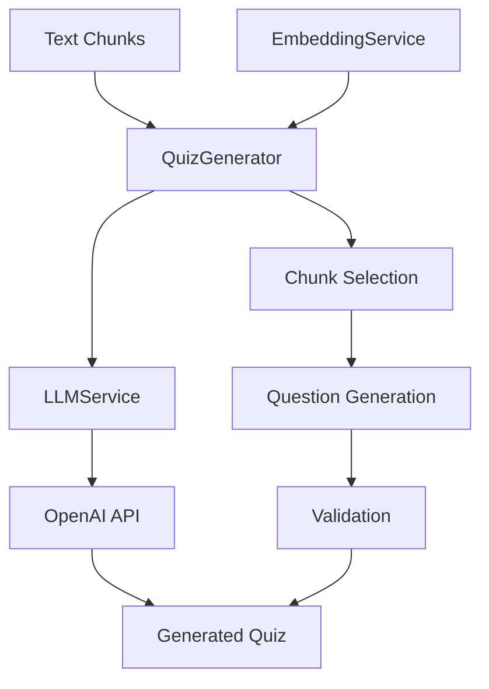

# quiz

---
type: directory
path: src/modules/quiz/
---

## 목적
LLM을 활용하여 텍스트 청크에서 다양한 형태의 퀴즈를 자동 생성하고 관리하는 모듈입니다.

## 주요 파일
| 파일 | 역할 |
|------|------|
| [[src/modules/quiz/llmService.js]] | OpenAI API 통합 및 LLM 서비스 |
| [[src/modules/quiz/quizGenerator.js]] | 퀴즈 생성 로직 및 품질 검증 |

## 하위 디렉토리
없음

## 관계


## 핵심 기능

### 1. LLM 서비스 (llmService.js)
- **텍스트 생성**: GPT-4 모델을 통한 고품질 텍스트 생성
- **임베딩 생성**: OpenAI 임베딩 API 통합
- **배치 처리**: 여러 요청의 병렬 처리
- **콘텐츠 조정**: 부적절한 콘텐츠 필터링

### 2. 퀴즈 생성기 (quizGenerator.js)
- **다양한 퀴즈 타입**: 객관식, OX, 단답형, 빈칸 채우기
- **난이도 조절**: 쉬움/보통/어려움 3단계
- **지능적 청크 선택**: 의미적 유사도 기반 선택
- **품질 검증**: 자동 검증 및 수동 검토 플래그

## 지원하는 퀴즈 타입

### 1. 객관식 (Multiple Choice)
```json
{
  "type": "multiple_choice",
  "question": "What is machine learning?",
  "options": [
    "A) A subset of artificial intelligence",
    "B) A programming language", 
    "C) A database system",
    "D) A web framework"
  ],
  "correctAnswer": "A",
  "explanation": "Machine learning is indeed a subset of AI..."
}
```

### 2. 참/거짓 (True/False)
```json
{
  "type": "true_false",
  "question": "Machine learning requires large datasets to be effective.",
  "correctAnswer": true,
  "explanation": "Generally true, though some techniques work with small data..."
}
```

### 3. 단답형 (Short Answer)
```json
{
  "type": "short_answer",
  "question": "Explain the difference between supervised and unsupervised learning.",
  "correctAnswer": "Supervised learning uses labeled data...",
  "explanation": "Key points to cover in the answer..."
}
```

### 4. 빈칸 채우기 (Fill in Blank)
```json
{
  "type": "fill_in_blank",
  "question": "_____ is a type of machine learning that uses neural networks.",
  "correctAnswer": "Deep learning",
  "explanation": "Deep learning specifically refers to..."
}
```

## 처리 흐름

### 퀴즈 생성 파이프라인


### 청크 선택 전략
1. **분산 선택**: 문서 전체에 균등 분포
2. **주제 기반**: 의미적 유사도 활용
3. **품질 기반**: 정보 밀도가 높은 청크 우선

## 프롬프트 엔지니어링

### 구조화된 프롬프트
```javascript
const prompt = `Based on the following text, generate a ${difficulty} difficulty ${type} question.

Text:
${chunkContent}

Format your response as JSON:
{
  "question": "Your question here",
  "options": [...], // for multiple choice
  "correctAnswer": "...",
  "explanation": "..."
}`;
```

### 타입별 최적화
- **객관식**: 1개 정답, 3개 그럴듯한 오답 생성
- **참/거짓**: 명확한 사실 기반 진술
- **단답형**: 개념 설명 요구
- **빈칸**: 핵심 키워드 제거

## 품질 보장

### 자동 검증
- **필수 필드**: 모든 필드 존재 확인
- **형식 검증**: JSON 파싱 가능 여부
- **길이 검증**: 적절한 질문/답변 길이
- **객관식 검증**: 4개 선택지 존재 확인

### LLM 기반 검증 (선택적)
```javascript
async validateQuestionWithLLM(question) {
  const prompt = `Please evaluate this quiz question for:
  1. Clarity and unambiguity
  2. Correctness of the answer
  3. Appropriateness of difficulty
  
  Question: ${question.question}
  Answer: ${question.correctAnswer}`;
  
  // 비용 고려하여 현재는 비활성화
  return true;
}
```

## 성능 특성

### 생성 속도
- **단일 문항**: ~3-5초
- **5문항 퀴즈**: ~15-25초
- **배치 처리**: 동시 생성으로 시간 단축

### 품질 지표
- **성공률**: ~95% (유효한 JSON 응답)
- **수동 검토 필요**: ~5% (requiresManualReview 플래그)
- **평균 문항 길이**: 80-120자

## 설정 옵션

### LLM 모델 설정
```javascript
LLM_CONFIG: {
  model: 'gpt-4-turbo-preview',
  maxTokens: 4000,
  temperature: 0.7  // 창의성과 일관성 균형
}
```

### 퀴즈 생성 옵션
```javascript
// 생성 요청 시 옵션
{
  quizType: 'multiple_choice',
  difficulty: 'medium',
  questionCount: 5,
  topicFocus: 'machine learning',
  customInstructions: '실용적인 예시 포함'
}
```

## 사용 예시

### 기본 퀴즈 생성
```javascript
const quizGenerator = new QuizGenerator();

const quiz = await quizGenerator.generateQuiz(embeddedChunks, {
  quizType: 'multiple_choice',
  difficulty: 'medium', 
  questionCount: 5
});
```

### 검색 기반 퀴즈
```javascript
const queryQuiz = await quizGenerator.generateQuizFromQuery(
  "neural networks",
  embeddedChunks,
  {
    quizType: 'short_answer',
    difficulty: 'hard',
    questionCount: 3
  }
);
```

### 퀴즈 통계 확인
```javascript
const stats = quizGenerator.getQuizStats(quiz);
console.log('타입별 분포:', stats.byType);
console.log('난이도별 분포:', stats.byDifficulty);
console.log('검토 필요 문항:', stats.questionsWithIssues);
```

## 오류 처리

### 일반적인 문제
1. **JSON 파싱 실패**: 수동 추출 시도
2. **불완전한 응답**: 기본값으로 채움
3. **API 한도 초과**: 재시도 로직
4. **저품질 문항**: requiresManualReview 플래그

### 복구 전략
```javascript
// JSON 파싱 실패 시 수동 추출
extractQuestionManually(response, options) {
  const lines = response.split('\n').filter(line => line.trim());
  return {
    question: lines[0] || 'Question extraction failed',
    correctAnswer: 'Manual verification required',
    requiresManualReview: true
  };
}
```

## 확장 계획

### 1. 다국어 퀴즈 지원
```javascript
// 언어별 프롬프트 최적화
generateQuestionPrompt(content, options, language = 'en') {
  const prompts = {
    'ko': '다음 텍스트를 바탕으로 한국어 문제를 생성하세요...',
    'en': 'Based on the following text, generate an English question...'
  };
  return prompts[language] + content;
}
```

### 2. 고급 퀴즈 타입
- **이미지 기반**: 차트/다이어그램 문제
- **순서 배열**: 단계별 프로세스 문제  
- **매칭**: 개념-정의 연결 문제

### 3. 적응형 난이도
```javascript
// 사용자 성과 기반 난이도 조정
adjustDifficultyBasedOnPerformance(userStats) {
  if (userStats.accuracy > 0.9) return 'hard';
  if (userStats.accuracy < 0.5) return 'easy';
  return 'medium';
}
```

## 모니터링 포인트
- **토큰 사용량**: LLM API 비용 추적
- **응답 시간**: 문항 생성 시간 분석
- **품질 지표**: 수동 검토율, 사용자 피드백
- **실패율**: 파싱 실패, 검증 실패 추적

## 관련 모듈
- [[src/modules/embedding/embeddingService.js]]: 의미적 청크 선택
- [[src/core/config.js]]: LLM 모델 설정
- [[src/utils/logger.js]]: 로깅 및 모니터링

## 디버깅 팁
1. **프롬프트 로깅**: 생성된 프롬프트 확인
2. **LLM 응답 저장**: 실패 케이스 분석용
3. **청크 품질 검증**: 입력 청크의 정보 밀도 확인
4. **온도 조정**: 일관성 vs 창의성 밸런스 조정
